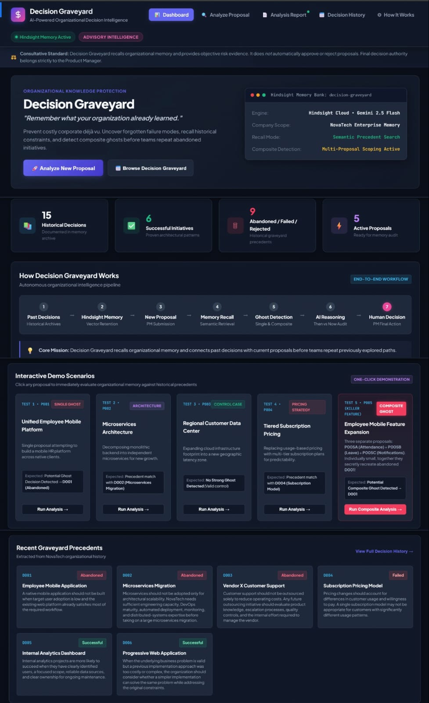
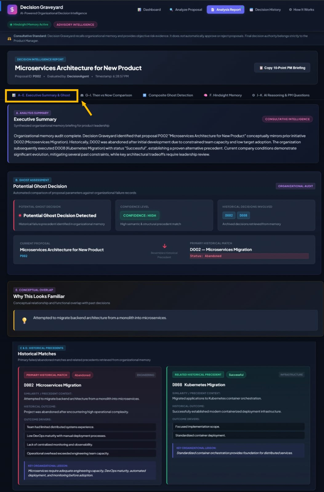

# 🪦 Decision Graveyard

### AI-Powered Organizational Decision Intelligence

> **"Before making a decision, remember what your organization has already learned."**

Decision Graveyard is an AI-powered decision intelligence system that gives organizations persistent memory of their past decisions, including why decisions were made, what alternatives were considered, and what happened afterward. It uses **Hindsight memory + Gemini AI reasoning** to identify when a new proposal resembles a previously rejected, failed, or abandoned decision and helps teams understand whether the original blockers still apply today.

## 🎥 Demo

### Dashboard



### Analysis Report



> The system analyzes a new proposal, recalls relevant organizational memories, detects potential Ghost Decisions, compares past and present conditions, and provides evidence for human review.

---

# Features

### 🧠 Persistent Organizational Memory

Decision Graveyard uses **Hindsight** to retain and recall historical organizational decisions.

It remembers:

- What was decided
- Why it was decided
- Alternatives considered
- Historical outcomes
- Historical blockers
- Relevant organizational context

---

### 👻 Ghost Decision Detection

The system identifies when a new proposal resembles something the organization has already considered.

Example:

```text
Historical Decision
D001 — Employee Mobile Application
              ↓
        Hindsight Recall
              ↓
Current Proposal
P001 — Unified Employee Mobile Platform
              ↓
Potential Ghost Decision
```

---

### 🧩 Composite Ghost Detection

Multiple small proposals can collectively recreate an older decision.

Example:

```text
P005A — Mobile Attendance
        +
P005B — Mobile Leave Management
        +
P005C — Mobile Notifications
        ↓
Composite Analysis
        ↓
D001 — Employee Mobile Application
```

---

### 🔄 Past vs Present Analysis

The system compares historical blockers with current organizational conditions.

For example:

```text
                    THEN        NOW

Mobile Adoption      18%        76%
Engineering Team      5          15
DevOps Maturity      Low        High
Deployment          Manual      Automated
Monitoring          Limited     Centralized
```

This helps determine which historical problems may still apply and which conditions may have changed.

---

### 👤 Human-in-the-Loop Decision Making

Decision Graveyard does **not** automatically approve or reject proposals.

Instead, it provides:

- Historical evidence
- Related decisions
- Historical blockers
- Current conditions
- Reasoning
- Human review questions

The final decision remains with the human decision-maker.

---

### 📊 Decision Intelligence Reports

Each proposal produces a structured analysis containing the relevant historical context and reasoning needed for informed review.

---

# How It Works

```text
                    ┌──────────────────────┐
                    │   New Proposal       │
                    │    P001 / P002 ...   │
                    └──────────┬───────────┘
                               │
                               ▼
                    ┌──────────────────────┐
                    │      Frontend        │
                    │  HTML/CSS/JavaScript │
                    └──────────┬───────────┘
                               │
                               ▼
                    ┌──────────────────────┐
                    │       FastAPI        │
                    │       Backend        │
                    └──────────┬───────────┘
                               │
                               ▼
                    ┌──────────────────────┐
                    │   Decision Agent     │
                    └──────────┬───────────┘
                               │
                 ┌─────────────┴─────────────┐
                 │                           │
                 ▼                           ▼
       ┌──────────────────┐        ┌──────────────────┐
       │ Hindsight Memory │        │   Gemini AI      │
       │     Recall       │        │    Reasoning     │
       └────────┬─────────┘        └────────┬─────────┘
                │                           │
                └─────────────┬─────────────┘
                              ▼
                  ┌────────────────────────┐
                  │   Ghost Detection      │
                  │          +             │
                  │ Composite Detection    │
                  └────────────┬───────────┘
                               │
                               ▼
                  ┌────────────────────────┐
                  │ Past vs Present        │
                  │ Condition Analysis     │
                  └────────────┬───────────┘
                               │
                               ▼
                  ┌────────────────────────┐
                  │ Decision Intelligence  │
                  │        Report          │
                  └────────────┬───────────┘
                               │
                               ▼
                  ┌────────────────────────┐
                  │    Human Review         │
                  │   Final Decision        │
                  └────────────────────────┘
```

---

# Tech Stack

| Layer | Technology |
|---|---|
| Frontend | HTML, CSS, JavaScript |
| Backend | Python, FastAPI |
| AI / LLM | Google Gemini 2.5 Flash |
| Persistent Memory | Hindsight by Vectorize |
| Data | JSON |
| Validation | Pydantic |
| Configuration | python-dotenv |
| Server | Uvicorn |
| Version Control | Git + GitHub |

### AI Architecture

The project separates memory and reasoning:

```text
Hindsight
    ↓
Persistent Organizational Memory

Gemini
    ↓
Reasoning and Analysis

Decision Agent
    ↓
Combines Memory + Reasoning
```

---

# Quick Start

## Prerequisites

Before running the project, install:

- Python 3.10+
- Git
- Google Gemini API key
- Hindsight API key

You will also need access to the Hindsight service.

---

## Install

Clone the repository:

```bash
git clone https://github.com/jahnvisrilatha/decision-graveyard.git
```

Move into the project directory:

```bash
cd decision-graveyard
```

Create a virtual environment:

```bash
python -m venv .venv
```

### Windows PowerShell

Activate the environment:

```powershell
.\.venv\Scripts\Activate.ps1
```

Install dependencies:

```powershell
pip install -r requirements.txt
```

---

## Configure `.env`

Create a `.env` file in the project root.

Use `.env.example` as a template.

Example:

```env
GEMINI_API_KEY=your_gemini_api_key

HINDSIGHT_BASE_URL=https://api.hindsight.vectorize.io
HINDSIGHT_BANK_ID=decision-graveyard
HINDSIGHT_API_KEY=your_hindsight_api_key
```

### Important

Never commit your real `.env` file to GitHub.

The repository already contains:

```text
.env.example
```

for configuration reference.

---

## Seed Memory (Hindsight)

Historical decisions need to be stored in Hindsight before running the complete memory-based workflow.

The historical decisions are located in:

```text
data/historical_decisions.json
```

Use the project's historical-memory ingestion script:

```powershell
python scripts/ingest_historical_decisions.py
```

This stores the historical NovaTech decisions in the Hindsight memory bank:

```text
decision-graveyard
```

The ingestion process is designed to be idempotent, so historical decisions can be safely seeded without intentionally creating duplicate memory records.

---
## Setup Checklist

Before starting the application, make sure you have completed the following:

- [ ] Python 3.10 or later is installed.
- [ ] The repository has been cloned locally.
- [ ] A Python virtual environment has been created and activated.
- [ ] Project dependencies have been installed using `requirements.txt`.
- [ ] A `.env` file has been created from `.env.example`.
- [ ] Valid Gemini and Hindsight API credentials have been configured.
- [ ] Historical decisions have been seeded into Hindsight.
- [ ] The FastAPI backend is ready to start.

Once these steps are complete, start the backend using:

```powershell
python -m uvicorn api.main:app --reload

## Run

Start the FastAPI backend:

```powershell
python -m uvicorn api.main:app --reload
```

The backend will be available at:

```text
http://127.0.0.1:8000
```

API documentation:

```text
http://127.0.0.1:8000/docs
```

Open the frontend in the browser according to the project's local frontend setup.

---

# Demo Scenarios

The project uses fictional company **NovaTech** to demonstrate different decision-intelligence scenarios.

| ID | Scenario | Purpose | Expected Behavior |
|---|---|---|---|
| **P001** | Unified Employee Mobile Platform | Tests a direct/reworded revival of D001 | Detect potential Ghost Decision |
| **P002** | Microservices Architecture for New Product | Tests D002 under changed conditions | Recall historical context and compare past vs present |
| **P003** | Regional Customer Data Center Expansion | Control scenario | No strong historical match expected |
| **P004** | Tiered Subscription Pricing | Tests relationship with D004 | Recall related pricing decision and analyze context |
| **P005** | Mobile Attendance + Leave + Notifications | Composite scenario | Detect that multiple proposals may collectively recreate D001 |

### P001 — Ghost Decision

```text
P001
Unified Employee Mobile Platform
            ↓
Hindsight Recall
            ↓
D001
Employee Mobile Application
            ↓
Potential Ghost Decision Detected
```

---

### P005 — Composite Ghost Decision

```text
P005A — Mobile Attendance
             +
P005B — Mobile Leave Management
             +
P005C — Mobile Notifications
             ↓
       Composite Analysis
             ↓
D001 — Employee Mobile Application
```

This demonstrates how several smaller initiatives can collectively resemble a historical decision.

---

# API Endpoints

| Method | Endpoint | Purpose |
|---|---|---|
| `GET` | `/health` | Check whether the backend is running |
| `GET` | `/proposals` | Retrieve available proposals |
| `POST` | `/analyze/{proposal_id}` | Analyze a proposal |
| `GET` | `/reports/{proposal_id}` | Retrieve an existing analysis report |

### Example

Analyze P001:

```http
POST /analyze/P001
```

Retrieve the generated report:

```http
GET /reports/P001
```

Interactive API documentation is available at:

```text
http://127.0.0.1:8000/docs
```

---

# Project Structure

```text
decision_gravyard/
│
├── agent/
│   ├── __init__.py
│   ├── data_loader.py
│   ├── decision_agent.py
│   ├── ghost_detector.py
│   ├── hindsight_memory.py
│   ├── llm_client.py
│   ├── models.py
│   └── multi_proposal_detector.py
│
├── api/
│   └── main.py
│
├── data/
│   ├── company_context.json
│   ├── current_proposals.json
│   └── historical_decisions.json
│
├── frontend/
│   ├── app.js
│   ├── index.html
│   └── styles.css
│
├── memory/
│
├── scripts/
│
├── scratch/
│
├── .env.example
├── .gitignore
├── README.md
├── requirements.txt
└── test_hindsight_connection.py
```

### Important Components

#### `decision_agent.py`

Main orchestration layer connecting proposal analysis, memory retrieval, Ghost Detection, Composite Detection, and AI reasoning.

#### `hindsight_memory.py`

Handles communication with Hindsight for persistent memory operations.

#### `ghost_detector.py`

Analyzes whether a current proposal resembles a historical decision.

#### `multi_proposal_detector.py`

Analyzes multiple proposals together to identify composite Ghost Decisions.

#### `llm_client.py`

Handles communication with the configured language model.

#### `models.py`

Contains structured Pydantic models used by the application.

#### `data_loader.py`

Loads and validates project data.

#### `api/main.py`

Provides the FastAPI endpoints.

---

# Limitations

### 1. Prototype Dataset

The current demonstration uses fictional NovaTech data rather than real enterprise data.

### 2. Historical Data Quality

The quality of the results depends on the completeness and accuracy of the historical decision records.

### 3. AI Reasoning Limitations

Gemini-generated reasoning can contain errors and should be reviewed by a human.

### 4. Similarity Does Not Mean Equivalence

A current proposal may resemble a historical decision without being exactly the same decision.

### 5. Human Review is Required

The system is designed as a decision-support system, not an autonomous decision-maker.

### 6. Limited Prototype Scale

The current prototype contains a relatively small set of historical decisions and demonstration proposals.

---

# Future Scope

Future versions of Decision Graveyard could include:

### 🧠 Larger Organizational Memory

Connect the system to larger collections of:

- Meeting notes
- Decision documents
- Project reports
- Product documentation
- Engineering records

### 🔗 Organizational Knowledge Graph

Build relationships between:

```text
Decisions
    ↓
Projects
    ↓
Teams
    ↓
People
    ↓
Outcomes
```

### 📈 Decision Outcome Learning

After a human makes a decision, the eventual outcome could be stored back into Hindsight.

```text
Historical Decision
       ↓
New Proposal
       ↓
AI Analysis
       ↓
Human Decision
       ↓
Real Outcome
       ↓
Hindsight Memory
```

This would allow the organizational memory to continuously evolve.

### 🔍 Advanced Composite Detection

Future versions could identify more complex combinations of proposals across departments and time periods.

### 🏢 Enterprise Integrations

Potential integrations include:

- Project management systems
- Internal documentation platforms
- Product management tools
- Collaboration platforms
- Enterprise knowledge bases

---

# License

This project is intended as a prototype and demonstration of AI-powered organizational decision intelligence.

Add your preferred open-source license here before distributing the project publicly.

For example:

```text
MIT License
```

If an MIT License is selected, the complete license text should be added to a `LICENSE` file in the repository.